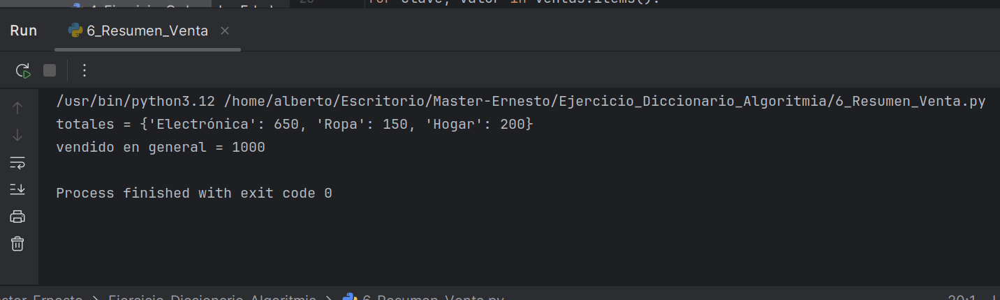

# Resumen de Ventas por Categoría (Diccionarios)
- Descripción del Proyecto
Este repositorio contiene un diseñado para demostrar el procesamiento y resumen de datos de ventas utilizando diccionarios. El programa calcula los totales de ventas por diferentes categorías de productos (electrónica, ropa, hogar) y luego determina el total de ventas general. Es una excelente demostración del uso de diccionarios para organizar y manipular datos estructurados.

## Características Principales
- Agregación por Categoría: Calcula la suma de ventas para distintas categorías de productos.

- Total General de Ventas: Determina la cantidad total vendida entre todas las categorías.

- Uso Eficiente de Diccionarios: Demuestra cómo los diccionarios son ideales para almacenar y acceder a datos clave-valor, como categorías y sus          respectivos totales

- Salida Clara y Concisa: Presenta los resultados de manera organizada, mostrando los totales  

## Imagen de la impresion por pantalla

